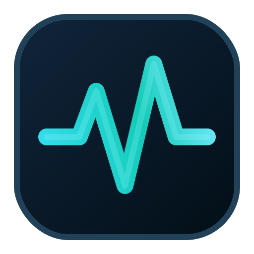

<p align="center">
  
</p>

<h1 align="center">WhereMyTokens for macOS</h1>

<p align="center">
  <strong>Claude Code、Codex、Antigravity の使用量を macOS メニューバーで確認するローカル優先アプリです。</strong>
</p>

<p align="center">
  
  
</p>

<p align="center">
  <a href="README.md">English</a> · <a href="README.ko.md">한국어</a> · <a href="README.zh-CN.md">中文</a> · <a href="README.es.md">Español</a>
</p>

> This file is a macOS edition summary. The English and Korean READMEs are the canonical detailed documents.

<a id="screenshots"></a>

<table>
  <tr>
    <th>ダーク概要</th>
  </tr>
  <tr>
    <td></td>
  </tr>
  <tr>
    <th>ライト概要</th>
  </tr>
  <tr>
    <td></td>
  </tr>
</table>

## 最新アップデート

| バージョン | 日付 | 主な変更 |
|------------|------|----------|
| **mac-v1.0.0** | 2026-06-17 | macOS release track の初回版。メニューバー、DMG/ZIP、macOS data paths、Claude/Codex/Antigravity tracking を追加。 |

## インストール

### DMG

1. Release assets から `WhereMyTokens-<version>-mac-arm64.dmg` をダウンロードします。
2. DMG を開きます。
3. `WhereMyTokens.app` を `/Applications` にドラッグします。
4. `/Applications` から起動します。

現在のローカルビルドは ad-hoc signed ですが、Apple notarization はまだありません。内部テストでは右クリックして **Open** を選ぶか、**System Settings -> Privacy & Security -> Open Anyway** を使ってください。公開配布には Developer ID signing、notarization、stapling が必要です。

### ZIP

1. `WhereMyTokens-<version>-arm64-mac.zip` をダウンロードします。
2. 解凍します。
3. `WhereMyTokens.app` を `/Applications` に移動します。

### ソースからビルド

```bash
npm install
npm run dist:mac
```

Generated artifacts:

| Artifact | Purpose |
|----------|---------|
| `release/mac-arm64/WhereMyTokens.app` | macOS app bundle. |
| `release/WhereMyTokens-<version>-mac-arm64.dmg` | Drag-to-Applications installer. |
| `release/WhereMyTokens-<version>-arm64-mac.zip` | Zipped app archive. |

Current target: Apple Silicon (`arm64`). Add x64 or universal builds before distributing to Intel Mac users.

## macOS 設計

- Dock icon is hidden; the app behaves as a macOS menu bar utility.
- The popup opens from the menu bar item and is clamped inside the active display.
- App data uses `~/Library/Application Support/WhereMyTokens`.
- Debug logs use `~/Library/Logs/WhereMyTokens`.
- The app bundle includes an `.icns` generated from the existing app mark.
- The current icon is wired correctly for macOS packaging, but public distribution should include a final macOS icon review at Finder, Dock, Spotlight, and DMG sizes.
- The current DMG uses the default `electron-builder` presentation; a polished public release should add a custom DMG background and notarized Developer ID signing.

## プライバシー

WhereMyTokens is local-first. It reads local Claude, Codex, and Antigravity sources and does not upload session logs.

Important local paths:

```text
~/Library/Application Support/WhereMyTokens
~/Library/Application Support/WhereMyTokens/live-session.json
~/Library/Application Support/WhereMyTokens/usage-ledger.json
~/.claude/projects/**/*.jsonl
~/.codex/sessions/**/*.jsonl
```

Antigravity support uses local RPC on `127.0.0.1` only. It does not use Google OAuth, refresh tokens, Google cloud usage endpoints, or offline database fallback.

Settings includes a **Rebuild ledger** action for replaying persisted usage totals from local history.
