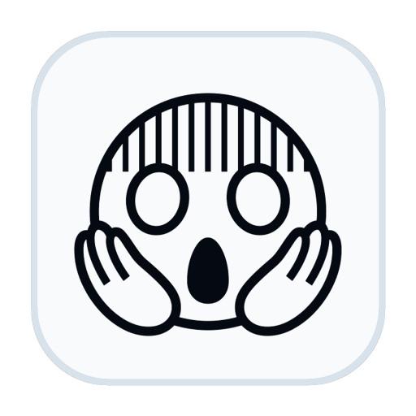

<p align="center">
  
</p>

<h1 align="center">WhereMyTokens for macOS</h1>

<p align="center">
  <strong>Claude Code, Codex, and Antigravity usage, live in your macOS menu bar.</strong>
</p>

<p align="center">
  
  
  
  <a href="https://github.com/jeongwookie/WhereMyTokens-mac/releases/tag/mac-v1.0.0"></a>
</p>

<p align="center">
  <a href="README.ko.md">한국어</a> · <a href="README.ja.md">日本語</a> · <a href="README.zh-CN.md">中文</a> · <a href="README.es.md">Español</a>
</p>

<p align="center">
  <a href="#download"><strong>Download</strong></a>
  ·
  <a href="#first-run">First Run</a>
  ·
  <a href="#screenshots">Screenshots</a>
  ·
  <a href="https://github.com/jeongwookie/WhereMyTokens">Windows Edition</a>
</p>

WhereMyTokens for macOS is a local-first menu bar app for monitoring AI coding usage: quota windows, token totals, cost estimates, cache efficiency, sessions, model usage, activity patterns, and git output.

<a id="screenshots"></a>

<table>
  <tr>
    <th>Dark Overview</th>
  </tr>
  <tr>
    <td></td>
  </tr>
  <tr>
    <th>Light Overview</th>
  </tr>
  <tr>
    <td></td>
  </tr>
</table>

## Download

| Platform | Download | Best For |
|----------|----------|----------|
| macOS Apple Silicon | **[DMG Installer](https://github.com/jeongwookie/WhereMyTokens-mac/releases/download/mac-v1.0.0/WhereMyTokens-1.0.0-mac-arm64.dmg)** | Drag-to-Applications install |
| macOS Apple Silicon | **[ZIP App Archive](https://github.com/jeongwookie/WhereMyTokens-mac/releases/download/mac-v1.0.0/WhereMyTokens-1.0.0-arm64-mac.zip)** | Simple archive install |
| Windows 10/11 | **[Windows Edition](https://github.com/jeongwookie/WhereMyTokens/releases/tag/v1.19.0)** | Tray app with installer and portable ZIP |

By downloading or installing, you agree to the [End-User License Agreement](EULA.txt).

The current macOS build is ad-hoc signed but not Apple notarized. Until Developer ID signing and notarization are added, macOS may show an unidentified-developer warning on first launch. For testing, right-click the app and choose **Open**, or use **System Settings -> Privacy & Security -> Open Anyway**.

## First Run

1. Download the DMG, open it, and drag `WhereMyTokens.app` into `/Applications`.
2. Launch WhereMyTokens from `/Applications`.
3. Open the dashboard from the macOS menu bar.
4. Enable the providers you use: Claude Code, Codex, Antigravity, or any combination.
5. Optional: enable **Claude Code Integration** to register the `statusLine` bridge for live Claude context and fallback quota data.

Default local data location:

```text
~/Library/Application Support/WhereMyTokens
```

## What's New

| Version | Date | Highlights |
|---------|------|------------|
| **[v1.0.0](https://github.com/jeongwookie/WhereMyTokens-mac/releases/tag/mac-v1.0.0)** | Jun 17 | Start the independent macOS release track with menu bar packaging, DMG/ZIP artifacts, macOS data paths, Claude/Codex/Antigravity usage tracking, and Claude Desktop credential discovery |

## Highlights

- macOS menu bar app with Dock hidden on startup.
- `provider checkboxes` for Claude Code, Codex, Antigravity, or any combination.
- Provider adapters live under `src/main/providers/` so future providers can join the same quota/session/usage shape.
- Live Claude Code, Codex, and Antigravity quota cards with reset windows.
- Active and recent session tracking from local provider data.
- Today and all-time token, cost, cache, model, and call summaries.
- Activity heatmaps, rhythm charts, model usage, and tool breakdowns.
- Persistent totals use `usage-ledger.json`; **Rebuild ledger** in Settings can reset and replay local history.
- Local-first storage with no cloud sync or telemetry.

## Privacy

WhereMyTokens reads local provider files and only calls provider usage endpoints for enabled providers. It does not upload session logs, run cloud sync, or ask you to paste API keys.

Antigravity uses local RPC only. It does not use Google OAuth, refresh tokens, Google cloud usage endpoints, or offline database fallback.

See [Privacy and Security](docs/privacy-security.md) for the full data-source list.

## More

| Topic | Link |
|-------|------|
| Feature details | [docs/features.md](docs/features.md) |
| Privacy and security | [docs/privacy-security.md](docs/privacy-security.md) |
| Development and architecture | [docs/development.md](docs/development.md) |
| Release guide | [RELEASE.md](RELEASE.md) |

## License

MIT
