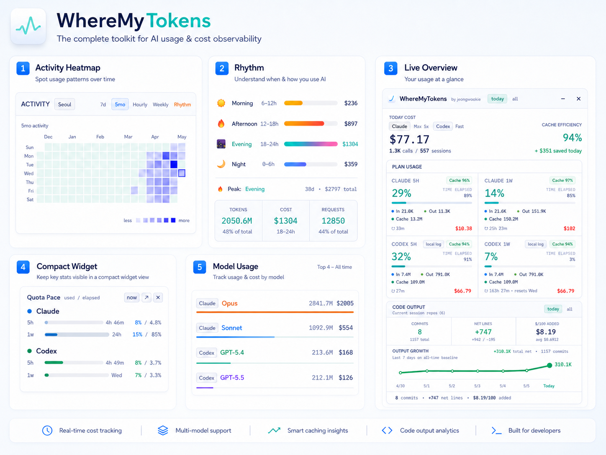

<p align="center">
  
</p>

<h1 align="center">WhereMyTokens</h1>

<p align="center">
  <strong>现已支持 Claude Code、Codex 和 Antigravity 追踪。</strong>
</p>

<p align="center">
  
  
  
  
</p>

<p align="center">
  
  
  
</p>

<p align="center">
  <a href="README.md">English</a> · <a href="README.ko.md">한국어</a> · <a href="README.ja.md">日本語</a> · <a href="README.es.md">Español</a>
</p>

<p align="center">
  <a href="https://github.com/jeongwookie/WhereMyTokens/releases/download/v1.18.2/WhereMyTokens-Setup.exe"><strong>下载 v1.18.2</strong></a>
  ·
  <a href="#功能特性">功能特性</a>
  ·
  <a href="#screenshots">截图</a>
</p>

<p align="center">
  <em>v1.18.2 修复长 Rich quota card title 撑开布局的问题，并保留 ellipsis 截断提示。</em>
</p>

<p align="center">
  一个本地优先的 Windows 托盘应用，可一目了然地查看 Claude Code、Codex 与 Antigravity 的令牌、费用、会话、缓存、模型使用量和速率限制。
</p>

<a id="screenshots"></a>

<table>
  <tr>
    <th>深色总览</th>
  </tr>
  <tr>
    <td></td>
  </tr>
  <tr>
    <th>浅色总览</th>
  </tr>
  <tr>
    <td></td>
  </tr>
</table>

> 由每天使用 Claude Code 的韩国开发者打造 — 为自己而做。

## 最新更新

| 版本 | 日期 | 主要变更 |
|------|------|--------|
| **[v1.18.2](https://github.com/jeongwookie/WhereMyTokens/releases/tag/v1.18.2)** | 6/5 | 修复长 Rich quota card title 撑开 Plan Usage 列的问题，同时保留 ellipsis 提示和 tooltip fallback |
| **[v1.18.1](https://github.com/jeongwookie/WhereMyTokens/releases/tag/v1.18.1)** | 6/4 | 稳定 Antigravity quota 选择与 pacing，避免启动 Partial History 循环，强化账号 label masking 和 model token stats 显示 |
| **[v1.18.0](https://github.com/jeongwookie/WhereMyTokens/releases/tag/v1.18.0)** | 6/2 | 新增 local-only Antigravity provider 支持，包括进程发现、local RPC quota/session 扫描、持久化 usage cache 和 provider ledger import |
| **[v1.17.0](https://github.com/jeongwookie/WhereMyTokens/releases/tag/v1.17.0)** | 6/2 | 基于 provider quota snapshot 重构 Plan Usage，新增按 target 的 Rich/Simple/None 展示分组，并强化 quota 状态恢复与迁移 |
| **[v1.16.1](https://github.com/jeongwookie/WhereMyTokens/releases/tag/v1.16.1)** | 5/27 | 修复截断或失败的 full-history ledger import，确保 budgeted warmup 持续运行并避免过期 provider completion marker |

[→ 完整更新日志](https://github.com/jeongwookie/WhereMyTokens/releases)

---

## 下载

**[⬇ 下载安装程序 (.exe)](https://github.com/jeongwookie/WhereMyTokens/releases/download/v1.18.2/WhereMyTokens-Setup.exe)** — 下载后直接运行即可

**[⬇ 下载便携 ZIP](https://github.com/jeongwookie/WhereMyTokens/releases/download/v1.18.2/WhereMyTokens-v1.18.2-win-x64.zip)** — 无需安装

下载或安装即表示您同意[最终用户许可协议 (EULA)](EULA.txt)。

**方式 A — 安装程序** _(推荐)_
1. 点击上方链接下载 `WhereMyTokens-Setup.exe`
2. 运行安装程序并按向导完成安装
3. 应用自动打开并驻留在系统托盘中

**方式 B — 便携 ZIP** _(无需安装)_
1. 在发布页面下载 `WhereMyTokens-v1.18.2-win-x64.zip`
2. 解压到任意位置
3. 运行 `WhereMyTokens.exe`

---

## 功能特性

### 会话追踪
- **Provider 选择** — 可在同一仪表板中追踪 Claude、Codex、Antigravity 或任意启用组合
- **实时会话检测** — 终端、VS Code、Cursor、Windsurf 等，实时状态：`active` / `waiting` / `idle` / `compacting`
- **紧凑分组** — 按 git 项目 → 分支分组，重复的 provider 会话会按 provider/source/model/state 堆叠
- **分支行数限制** — 每个分支默认显示前 3 行，其余通过 "Show N more" 展开
- **上下文窗口警告** — 每会话进度条；70% 琥珀色、85% 橙色、95%+ 红色
- **工具使用条** — 比例颜色条 + 工具标签（Bash、Edit、Read 等）

### 速率限制与提醒
- **Provider quota 条** — Claude、Codex、Antigravity 以及后续 provider 都通过 `providerQuotas` 发布有效 quota snapshot；Claude 按 Anthropic API/statusLine/cache 优先级显示，Codex 按 live usage/cache/local-log 优先级显示，Antigravity 使用 local RPC model quota snapshot
- **按 target 配置 quota 展示** — 每个 provider window 或 model target 都可以在 Settings 中设为 Rich、Simple 或隐藏；这里只影响 Plan Usage 和悬浮小部件展示
- **Quota Pace 视图** — 对比已用额度 % 与已过时间 %，黄色/红色表示使用节奏快于重置窗口
- **Claude Code 桥接** — 注册为 `statusLine` 插件，无需 API 轮询即可获取实时数据
- **Windows 通知** — 在可配置的使用阈值（50% / 80% / 90%）时弹出提醒
- **Claude Extra Usage 预算** — Claude 月度额度使用量 / 限额 / 利用率

### 分析与活动
- **标题栏统计** — today/all-time 切换：费用、API 调用、会话、缓存效率、节省金额、紧凑的 Claude/Codex 元数据，以及 provider 级 health/fallback 状态。`all` 的会话数来自完整使用历史
- **即时启动 snapshot** — 立即恢复上一次成功显示的 UI 状态，新的扫描继续在后台运行
- **启动友好的历史同步** — 先显示当前会话和最近用量；较早的历史会通过 budgeted refresh scheduler 在后台继续同步，让 hotkey popup 和 UI 保持响应
- **持久化使用账本** — 将本地 JSONL 用量写入本地聚合账本，让较早的总量不再依赖 JSONL cache；必要时可在 Settings 中重建
- **Trend 卡片** — 按天、周、月查看 cost/token 趋势，并叠加 git 净行数产出；缺失数据不会被误画成 0
- **活动标签页** — 7天热力图、5个月日历（GitHub 风格）、按小时分布、4周对比
- **Rhythm 标签页** — 按时段费用分布（Morning/Afternoon/Evening/Night），渐变条，峰值详细统计，本地时区
- **模型分析** — 按热门模型的令牌和费用总计，渐变条
- **Activity Breakdown** — Claude 按 output token 分析，Codex 按 tool event 分析 10 个类别（Thinking、Edit/Write、Read、Search、Git 等）

### 代码产出与生产力
- **Git 指标** — 提交数、净变更行数、**$/100 Added**（每100行新增的成本）
- **今日 vs 全部** — 今日显示每新增行实际成本与历史平均对比
- **Output 增长图** — 按最近 7 个本地日期显示全时段累计净行数增长
- **当前会话 repo 范围** — Code Output 会明确标注其 git 汇总是基于当前正在追踪的会话关联 repo
- **分支感知的全时段** — Code Output 的全时段会按本地 git 作者邮箱统计所有本地分支的提交和行变更
- **自动发现** — Claude 项目来自 `~/.claude/projects/` 并包含 agent 使用日志，Codex 会话来自 `~/.codex/sessions/`、`~/.codex/archived_sessions/`、`~/.codex/session-cleanup-archive/`，Antigravity 会话来自运行中的 IDE local RPC cascade
- **仅统计您的提交** — 按 `git config user.email` 过滤

### 个性化
- **Auto/Light/Dark 主题** — 默认跟随系统偏好
- **费用显示** — USD 或 KRW，可配置汇率
- **Floating usage widget** — 始终置顶显示的小型 Quota Pace 悬浮窗口；可从主头部、托盘菜单、Settings 或小部件按钮显示/隐藏。Waiting animation 默认关闭，可在 Settings 中重新开启
- **托盘标签** — 在任务栏直接显示使用率 %、令牌数或费用
- **仪表板布局** — 可调整卡片顺序，也可隐藏不需要的卡片
- **项目管理** — 隐藏或完全排除项目
- **随 Windows 启动** — 可选自动启动

---

## 快速开始

### 1. 打开仪表板
点击托盘图标（或按全局快捷键 `Ctrl+Shift+D`）。

### 2. 连接 Claude Code 桥接（可选）
**Settings → Claude Code Integration → Setup** — 无需 API 轮询即可获取实时速率限制数据。

### 3. 配置
- **Providers** — 勾选启用 Claude Code、Codex 和/或 Antigravity
- **货币** — USD 或 KRW
- **提醒** — 设置使用阈值（50% / 80% / 90%）
- **主题** — Auto（跟随系统）/ Light / Dark
- **托盘标签** — 选择任务栏显示内容
- **Main Layout** — 调整仪表板卡片顺序，或隐藏可选卡片
- **Data -> Rebuild ledger** — 需要修复历史总量时，可重建账本并从本地历史重新回放
- **Floating usage widget** — 启用小型 Quota Pace 窗口；之后可用主头部开关或托盘菜单显示/隐藏

---

## 架构

WhereMyTokens 是 local-first 的 Electron 托盘应用。renderer 不会直接读取本地文件或凭据；文件系统、provider API、托盘与设置逻辑都在 Electron main process 中处理，并且只通过 preload bridge 传递给 renderer。

| 层 | 职责 |
|----|------|
| Electron main | 发现 Claude/Codex/Antigravity 会话，解析本地使用来源，获取 provider 使用量，管理托盘/窗口状态，并持久化应用设置。 |
| Preload bridge | 在保持 `contextIsolation` 边界的同时，只暴露 typed `window.wmt` IPC surface。 |
| React renderer | 显示托盘仪表板、设置、通知、活动图表和 compact quota 小部件。 |
| `statusLine` bridge | `src/bridge/bridge.ts` 从 Claude Code stdin 接收 JSON，并写入 main process 监听的本地 bridge snapshot。 |

| 数据流 | 来源 | 目的地 | 网络 |
|--------|------|--------|------|
| Claude 会话 | `~/.claude/sessions/*.json`, `~/.claude/projects/**/*.jsonl` | main process parser/cache，然后进入 renderer state | 否 |
| Claude 桥接 | Claude Code `statusLine` stdin | `%APPDATA%\WhereMyTokens\live-session.json` | 否 |
| Claude quota snapshot | `~/.claude/.credentials.json` OAuth token | Anthropic `/api/oauth/usage` | 是，直接请求 Anthropic |
| Codex 会话 | `~/.codex/sessions/**/*.jsonl`, `~/.codex/archived_sessions/**/*.jsonl`, `~/.codex/session-cleanup-archive/**/*.jsonl` | main process parser/cache，然后进入 renderer state | 否 |
| Codex quota snapshot | `~/.codex/auth.json` OAuth token | ChatGPT/Codex usage endpoint | 是，直接请求 OpenAI/ChatGPT |
| Antigravity 会话、模型 quota 和使用 metadata | `127.0.0.1` 上运行中的 Antigravity language server | main process local RPC client，然后进入 renderer state | 无外部网络 |
| 聚合使用账本 | 本地 JSONL 用量摘要 | `%APPDATA%\WhereMyTokens\usage-ledger.json` | 否 |
| Git 产出账本 | 本地 git 扫描 | `%APPDATA%\WhereMyTokens\git-output-ledger.json` | 否 |

速率限制优先级按 provider 区分，并统一组装进 `AppState.providerQuotas`：Claude 优先使用 Anthropic API，然后是 `statusLine` bridge 与 cache；Codex 优先使用 live usage，然后是 cache 与 JSONL 日志中的本地 `rate_limits` 事件；Antigravity 使用运行中 IDE language server 的 local RPC model quota 数据。API/Bridge/Cache/Log/Local RPC 标签由 renderer 根据 snapshot 的 `source` 派生，不再作为主界面的独立状态字段维护。Settings 将 provider 启用状态与 target 展示模式分开保存。`Providers` 控制扫描、quota 拉取、会话显示、统计和提醒范围；`Quota display` 只保存每个 target 的 `Rich`、`Simple` 或 `None`，只影响 Plan Usage 和悬浮小部件展示。

---

## 安全与隐私

WhereMyTokens 会读取本地文件，并在启用时仅直接请求您自己账号的 provider 使用量 API。没有云同步，也没有遥测。

| 本地路径 | 用途 |
|----------|------|
| `~/.claude/sessions/*.json` | Claude 会话元数据，例如 pid、cwd、模型。 |
| `~/.claude/projects/**/*.jsonl` | 用于令牌数、费用、上下文和活动摘要的 Claude 对话日志。 |
| `~/.claude/.credentials.json` | Claude OAuth 信息，仅用于 Anthropic 使用量请求和过期 access token refresh。 |
| `~/.codex/sessions/**/*.jsonl` | 当前 Codex 会话日志，用于令牌、cached input、模型、rate-limit 事件和 tool 活动。 |
| `~/.codex/archived_sessions/**/*.jsonl` | 纳入 all-time 使用量的 Codex 归档会话日志。 |
| `~/.codex/session-cleanup-archive/**/*.jsonl` | 纳入 all-time 使用量的 Codex cleanup 归档日志。 |
| `~/.codex/auth.json` | ChatGPT OAuth 信息，仅用于 Codex 使用量 snapshot；不会复制到应用 storage，也不会记录到日志。 |
| `127.0.0.1` 上的 Antigravity local language server | Antigravity IDE 运行且已登录时的会话、逐模型 quota 百分比、重置时间和 token metadata。 |
| `%APPDATA%\WhereMyTokens\live-session.json` | Claude Code `statusLine` bridge 写入的本地 bridge snapshot。 |
| `%APPDATA%\WhereMyTokens\usage-ledger.json` | 聚合后的本地使用账本，用于长期总量、趋势桶和热力图。 |
| `%APPDATA%\WhereMyTokens\git-output-ledger.json` | 聚合后的每日 git 产出快照，供 Code Output 和 Trend 使用。 |
| Electron app data (`%APPDATA%\WhereMyTokens`) | 应用设置、本地缓存、通知历史和 bridge 状态。 |

凭据处理范围刻意保持很窄。WhereMyTokens 读取官方 CLI 的本地 credential 文件，不要求粘贴 API key，不保存单独的 credential 备份，也会从状态输出中隐藏 credential 细节。如果 Claude access token 过期，应用可能通过 Anthropic refresh，并将更新后的 credentials 原子写回 `~/.claude/.credentials.json`。

网络访问仅限已勾选启用 provider 的 usage endpoint 和本地 loopback。Claude usage polling 最多每 5 分钟执行一次，并带有 429 backoff。Codex live usage 使用 HTTPS-only request、timeout、响应大小限制、cache 和 backoff。Antigravity 只使用 loopback local RPC；不会使用 Google OAuth、refresh token、Google cloud usage endpoint 或离线数据库 fallback。本地 JSONL 解析、Antigravity local RPC 与 `statusLine` bridge 不会把会话内容发送到外部。

要禁用 Claude Code bridge，请打开 **Settings -> Claude Code Integration -> Disable**。应用只会在 `statusLine` entry 属于 WhereMyTokens bridge command 时移除它；不会覆盖或删除其他 custom `statusLine`。也可以手动删除 `~/.claude/settings.json` 中的 WhereMyTokens `statusLine` entry，然后重启 Claude Code。

---

## 启动与头部状态

启动时，仪表板会先显示当前会话和最近用量。如果看到 `Partial History`，说明较早的历史仍在按 budgeted background slice 同步，这样托盘应用和 hotkey popup 可以保持响应。

头部的小型 PiP 按钮可直接开关 Floating Quota Pace 小部件。头部状态 pill 会集中显示最重要的 provider/API 状态。常见标签包括 `Claude local`、`Claude partial`、`Claude refresh`、`Claude login`、`Claude limited`、`Claude offline`、`Antigravity unavailable` 和 `refresh failed`。Quota Pace 小部件会分别显示 `Claude OK`、`Codex OK`、`Antigravity OK` 等 provider health 标签；把鼠标移到 pill 或标签上可以查看最新细节。

---

## Provider 追踪详情

### Claude Code 桥接

WhereMyTokens 可以通过 Claude Code 官方 `statusLine` 插件机制实时接收上下文、模型、费用和回退用的速率限制数据。使用 **Settings -> Claude Code Integration -> Setup** 注册桥接，或使用 **Disable** 移除 WhereMyTokens 拥有的 bridge entry。

### Codex 追踪

WhereMyTokens 也可以读取 Codex 的本地 JSONL 日志：`~/.codex/sessions/**/*.jsonl`、`~/.codex/archived_sessions/**/*.jsonl`、`~/.codex/session-cleanup-archive/**/*.jsonl`。在 Settings 中勾选需要跟踪的 provider。

**Codex 追踪包含：**
- 会话状态、项目/分支分组，以及 VS Code、Codex Exec 等 source 标签
- GPT/Codex 模型使用量与 API 等价费用估算
- input、cached input、output 令牌、缓存节省金额和全时段模型合计
- 当 live Codex usage 可用时显示 Codex 5h/1w 使用率与 reset 时间；失败时回退到缓存/本地 `rate_limits` 事件
- Codex 日志提供 tool call，而不是每个工具的 output token，因此 Activity Breakdown 显示 tool event count

**Prompt 缓存计算：** Codex 日志提供 `input_tokens` 和 `cached_input_tokens`；WhereMyTokens 将 uncached input 保存为 `input_tokens - cached_input_tokens`，将 cached input 作为 cache-read token。Codex 与 Antigravity 都按 cache read 占 prompt token 的比例显示缓存效率：

```text
cache_read_tokens / (uncached_input_tokens + cache_creation_tokens + cache_read_tokens)
```

对 Codex 来说，这等价于 `cached_input_tokens / input_tokens`。Claude 则使用 cache write/read 效率：

```text
cache_read_input_tokens / (cache_read_input_tokens + cache_creation_input_tokens)
```

### Antigravity 追踪

WhereMyTokens 可以通过 `127.0.0.1` 上运行中的 Antigravity IDE local language server 读取已登录的 Antigravity 状态。在 Settings 中勾选 Antigravity provider 即可启用。

**Antigravity 追踪包含：**
- 与 Claude、Codex 共用 provider/session UI 的 cascade 会话分组
- 来自 `GetUserStatus` 的逐模型 quota 百分比和重置时间
- 来自 `GetCascadeTrajectoryGeneratorMetadata` 的 token metadata，并带有有界 full-trajectory fallback
- 对可识别的本地模型 metadata 显示 API 等价费用估算；未定价模型保持为 0 或隐藏

Antigravity 模型 quota 卡片默认仅显示百分比。在 Settings 中启用 **Antigravity quota pace** 后，会根据 reset time 估算 5h/weekly pacing。

Antigravity 支持保持 local-only。它不会读取 Google OAuth credential、refresh token、Google cloud usage endpoint、credits 或离线 `state.vscdb` 数据。

---

## 数字如何计算

令牌数会尽可能包含 **input + output + cache creation + cache reads**。费用始终是基于应用内价格表的 API 等价估算值。

Claude 提供 input、output、cache creation 与 cache read。Codex 提供 raw input、cached input 与 output，因此 WhereMyTokens 会把 raw input 拆成 uncached input 与 cached input，避免缓存节省金额和模型合计重复计算。

---

## 从源码安装

### 环境要求

- Windows 10 / 11
- [Node.js](https://nodejs.org) 18+
- [Claude Code](https://claude.ai/code) 已安装并登录

### 构建与运行

```bash
git clone https://github.com/jeongwookie/WhereMyTokens.git
cd WhereMyTokens
npm install
npm run build
npm start
```

---

## 演示

<div align="center">

https://github.com/user-attachments/assets/98b6f8d7-6fc6-4c12-aef1-af6300db0728

</div>

---

## 免责声明

显示的费用为 **API 等价估算值**，并非实际账单。Claude Max/Pro 订阅为月度固定费用。费用显示的是您从订阅中获得的使用价值。

---

## 贡献

欢迎提交 Issue 和 Pull Request。如需变更，请先开一个 Issue 进行讨论。

---

## 致谢

灵感来自 [duckbar](https://github.com/rofeels/duckbar) — macOS 版本。

---

## 许可证

MIT
